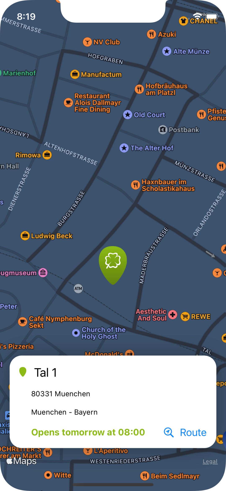

# BetshopFinder
A small app to locate betshops.

[//]: # "Badges"

This application helps you locate betshops in Germany using an integrated map. So, feel free to move around and pinch for zoom-in/zoom-out.

For details on a betshop, tap on it and see the opening hour or closing, as well as other information related to it.

When clicking on the "Route" button, you are transferred into your default navigation application with the desired Betshop selected as for you to be able to navigate to it by means of your preferred app for the matter.

---------

